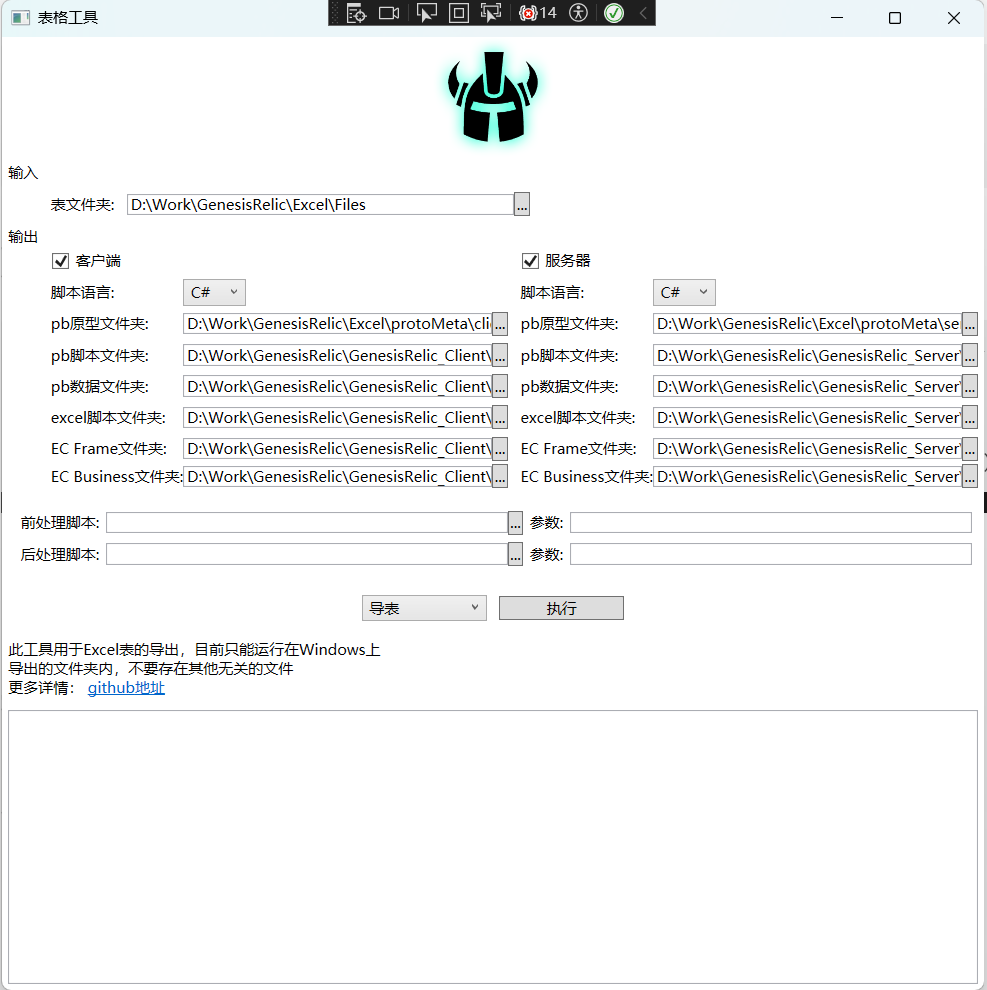
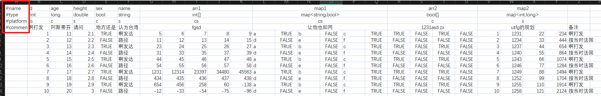
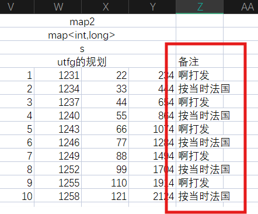
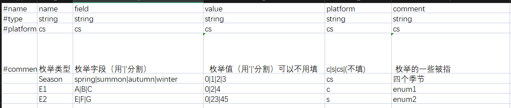
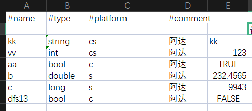

# 功能
	1. 支持双端同时导表（只能是.xlsx, 目前放弃了旧版的.xls）
	2. 多线程导表
	3. 可以扩展导出多种脚本语言
	4. 用户可以添加 自定义的前，后处理程序

# 解析流程
	普通表流程： 解析表头信息 -> 生成 proto meta 文件 -> 生成 proto Script 文件 -> 解析表数据内容 -> 生成 proto data 文件 -> 生成 excel Script 文件
	特殊表流程：
		Enum：解析表头信息 -> 生成 proto meta 文件 -> 生成 proto Script 文件
		ErrorCode: 解析表头信息和内容 -> 生成 ErrorCode Script 文件(静态，全局，键值对) 
		SingleExcel: 纵向解析表头信息 -> 生成 SingleExcel Script 文件(静态，业务全局，键值对)

# 图形界面说明

	
	对于非技术人员而言，只需要关注：1. 输入的表格文件夹；2. 执行按钮以及旁边的操作项；3. 最下面的Log信息栏；
	至于导出目录，一般用默认值就可以，至于这个默认值，让技术人员一开始设置好就可以了；当然要是你足够自信，也可以自行设置导出目录
	
## 1.导出目录
	因为导表的核心用了 protobuf; 所以 有 proto原型， 原型生成的脚本，以及proto数据 的目录
	至于 EC Frame 和 EC Business; 则是针对 ErrorCode这张特殊表的，具体请看下面的表格规则说明

## 2.自定义程序
	这个工具，传递自定义的程序，以扩充表格工具的功能。而自定义的程序文件，一般推荐 批处理文件或者.exe文件。这个行为比较极客了，可以玩出很多花样

## 3.表格文件夹
	这里输入得是表格文件夹的根目录；在其目录下面，还可以嵌套多个子目录:

	拥有多级目录，可以方便程序模块化的加载和释放表格资源

## 4.功能操作项
	
	这些功能项后续是可以扩展的.
	

# 表格规则说明
示例:

	标红的地方就是表头的类型
	目前支持的表头类型有：#name，#type，#platform，#comment
	如果没有#的行，表示内容行；如果#后面是其他内容，会报错
	一个表，可以多个 sheet; 都是会被导出的：最后导出的名字类似：表格名字_sheet名字

## 1. 表头类型说明
### a.#name
	1. 表示字段的名字，如果是空，那么这个字段将不会导出
	2. 名字不能重复，否则报错

### b.#tpye
	1. 基础类型：int， long, double, bool, string
	2. 容器：T[], map<k, v>: T, k, v只能是基础类型或者枚举类型，否则报错。因为proto的限制，map<k,v> 指定的类型不能是 double类型
	3. 枚举类型，枚举需要在Enum表中事先定义
	4. 本地化类型：%string: 需要多语言处理的文本；%%string: 需要多语言处理的图片路径
	5. 索引Id:  *"typeName": 独立key; **"typeName": 联合key

	注意：1. 类型名字可以空，但是改字段将不会导出；2. 如果是其他的类型字段，会报错

### c.#platform
	c: 客户端
	s: 服务器
	cs: 服务器端和服务器都会导出
	空：都不导出

### d.#comment
	对字段的说明。它不会作为数据导出，只是用于说明
	如果你不单单是要对某个字段说明。也想对具体某一行的数据内容做说明怎么办呢？
		因为 name, type, platform 字段空，就不会导出，自然可以利用这点写一些自定义的注释。比如：
		

## 2.特殊表

### a.枚举表
	表格名字是固定的： Enum.xlsx; 并且只能有一个
示例:

	这些表头字段的名字（name, field, value, platform, comment）和类型是固定的，缺少或者不匹配会报错
	field 和 value 字段是对应的
	因为proto的原因，value第一个值只能0
	
### b.单例表
	一般的表都是有多行数据内容的，但是存在一张表，它只有一行数据内容，比如定义全局变量的表，只需要一行数据就可以了。这样的表就是所谓的单例表
	因为只有一行的数据内容，如果把表纵向排列，更加方便些

示例:

	（注意看，这个表的排版是纵向的）
	单例表是通过名字前缀确定的，只要前缀是"[Single]"就被定义为单例表，按照单例表规则解析。单例表可以有多个。

### c.ErrorCode表
	客户端和服务器为了统一错误（也可以是其他的）信息，需要这样表中定义的字段来沟通。一般有程序维护，策划只需要填写显示的错误信息内容就可以了
	
示例:

	ErrorCode表是按照名字确定的, 只能有一个

# TODO
	1. 这个工具在实现的时候，虽然用到了多线程；但是因为经验问题，没有使用异步，导致导表的时候卡顿一下，一次性出现所有log；后续有时间再完善

# Q&A
	1. 这个工具打不开呀
	可能是环境不对，这个工具目前只能运行在Windows上，并且需要有.net环境，下载一个.net9 sdk:
	[.net9 sdk page](https://dotnet.microsoft.com/en-us/download/dotnet/9.0).